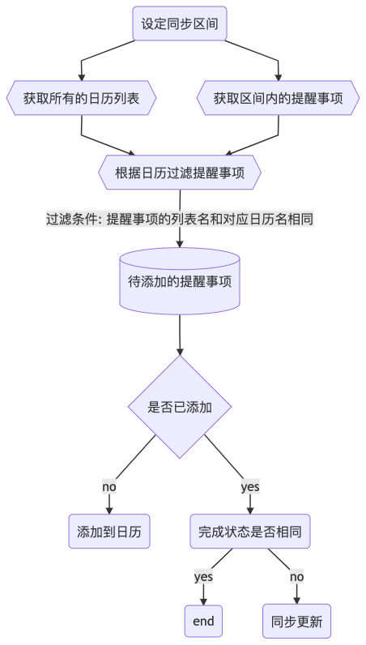

## Scriptable 脚本
### 同步日历和提醒事项

#### 初衷
ios 的提醒事项和日历功能都很好用，但还是有些不是很满意的地方

+ ios 的提醒事项没有日历功能
+ 直接把事项记在日历缺少完成任务toggle的快感 & 一些不确定什么时候做的💡没地方放

因此，写了个scriptsable 脚本，用于同步日历和提醒事项

+ 提醒事项用于做todo
+ 日历用于做记录，方便复盘

#### 食用指南
1. 下载 [scriptable](https://scriptable.app/)
2. 新建脚本
3. 拷贝以下内容到脚本，保存执行
```js
const events = await Calendar.forEvents();
const eventTitles = events.map(event => event.title);
// 获取当前所有的reminder
const reminders = await Reminder.allDueToday();
const processingEvents = [];
for (let reminder of reminders) {
  if (eventTitles.indexOf(reminder.calendar.title) !== -1) {
    processingEvents.push(reminder);
  }
}

// 写入到 caldendar
processingEvents.forEach(reminder => {
  const newEvent = new CalendarEvent();
  const calendar = events.find(
    event => event.title === reminder.calendar.title
  );
  addEvent(newEvent, calendar, reminder);
});

/**
 *
 * @param {CalendarEvent} event 待添加到日历的时间
 * @param {*} calendar 待添加日历
 * @param {*} reminder 代办事项
 */
function addEvent(event, calendar, reminder) {
  event.title = reminder.title;
  event.notes = reminder.notes;
  event.startDate = reminder.dueDate;
  event.calendar = calendar;
  event.allDay = true;
  event.save();
}
```

#### 实现流程
